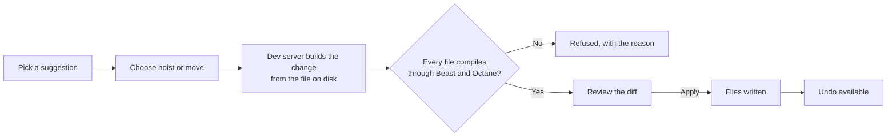
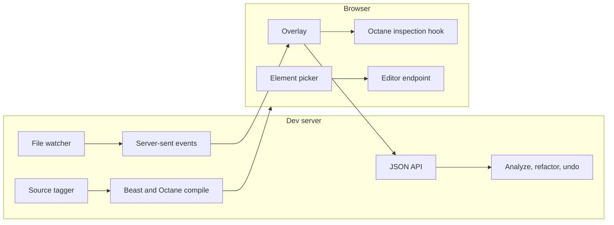

# Beast DevTools

> In-page devtools for [Beast](https://www.npmjs.com/package/beast-tsrx) (BTSX)
> and [Octane](https://octanejs.dev/) apps.

[](https://www.npmjs.com/package/@beastjs/devtools)
[](package.json)
[](package.json)
[](package.json)
[](#quick-start)
[](LICENSE)

**See the live tree. Read the compiled output. Flatten deep templates in one
click.**

[Install](#installation) ·
[Quick start](#quick-start) ·
[Using the overlay](#using-the-overlay) ·
[Automatic refactors](#automatic-refactors) ·
[Configuration](#configuration) ·
[Security](#security-model) ·
[Troubleshooting](#troubleshooting)

---

Beast DevTools adds a panel to your app while it runs on the Vite, Rspack or
Rsbuild dev server. It shows the live Octane component tree with hook and
context values, puts every `.btsx` file next to the TSRX it compiles to, and
finds templates nested too deeply. It can then extract those sections into
components for you, with typed props, after showing you the diff.

Production builds are untouched. The plugin runs on the dev server only.

## At a glance

| Capability | What it does | Why it matters |
| --- | --- | --- |
| **Components** | Live component tree with hooks, context and effects | Debug state without logging |
| **Element picker** | Hover the page to see a component and its `.btsx` line | Go from pixels to source |
| **BTSX → TSRX** | Source and compiled output, linked line by line | See what Beast generates |
| **Refactor** | Finds deep nesting, repeated markup and sibling runs | Keeps templates readable |
| **Auto-refactor** | Writes the component, props interface and imports | Refactors in one reviewed step |
| **Undo** | Restores the files a refactor touched | Makes changes low-risk |

## Requirements

| Dependency | Version |
| --- | --- |
| `beast-tsrx` | `^0.4.3` |
| `octane` | `^0.4.3` |
| Node.js | `>=22.22.2` |
| `typescript` *(optional)* | `>=5.0.0`, for typed props in refactors |

Plus one bundler:

| Bundler | Packages | Version |
| --- | --- | --- |
| Vite | `vite` | `^8.0.16` |
| Rspack | `@rspack/core` and `@rspack/dev-server` | `^2.0.0` |
| Rsbuild | `@rsbuild/core` | `^2.0.0` |

## Installation

```bash
bun add -d @beastjs/devtools
```

```bash
npm install -D @beastjs/devtools
```

## Quick start

Add the plugin next to `beastOctane()`, importing it from your bundler's entry
point. Octane's `profile` option compiles in the runtime inspection hook that
the Components panel reads. Enable it for development only.

### Vite

```ts
// vite.config.ts
import { beastOctane } from 'beast-tsrx/vite'
import { beastDevtools } from '@beastjs/devtools/vite'
import { defineConfig } from 'vite'

export default defineConfig({
  plugins: [
    // `profile: 'auto'` enables the inspection hook in dev builds only.
    beastOctane({ octane: { profile: 'auto' } }),
    beastDevtools(),
  ],
})
```

`@beastjs/devtools` without a subpath is also the Vite plugin.

### Rspack

```ts
// rspack.config.ts
import { beastOctane } from 'beast-tsrx/rspack'
import { beastDevtools } from '@beastjs/devtools/rspack'

export default {
  module: { rules: [{ test: /\.css$/, type: 'css' }] },
  plugins: [
    // Rspack's `profile` is a boolean; the CLI sets NODE_ENV before loading this file.
    beastOctane({ octane: { profile: process.env.NODE_ENV !== 'production' } }),
    beastDevtools(),
  ],
}
```

> [!IMPORTANT]
> The overlay imports a stylesheet, so an Rspack config needs a rule for
> `.css` files.

The plugin hooks into `devServer.setupMiddlewares`, so it runs under
`rspack serve`. If you start `RspackDevServer` yourself, pass it
`compiler.options.devServer`. In a multi-compiler config, add the plugin to the
browser config that has `devServer`.

### Rsbuild

```ts
// rsbuild.config.ts
import { defineConfig } from '@rsbuild/core'
import { beastOctane } from 'beast-tsrx/rsbuild'
import { beastDevtools } from '@beastjs/devtools/rsbuild'

export default defineConfig({
  plugins: [
    ...beastOctane({ octane: { profile: process.env.NODE_ENV !== 'production' } }),
    beastDevtools(),
  ],
})
```

The overlay loads in every `web` environment. Server environments are left
alone.

Start the dev server and press <kbd>Alt</kbd>+<kbd>Shift</kbd>+<kbd>D</kbd>, or
click the **Beast** button in the bottom-right corner.

## Using the overlay

### Keyboard and mouse

| Action | How |
| --- | --- |
| Open or close the panel | <kbd>Alt</kbd>+<kbd>Shift</kbd>+<kbd>D</kbd>, or the **Beast** button |
| Start or stop the element picker | <kbd>Alt</kbd>+<kbd>Shift</kbd>+<kbd>C</kbd>, or the crosshair button |
| Cancel picking | <kbd>Esc</kbd> |
| Resize the panel | Drag its top edge |
| Resize a pane | Drag the edge between two panes |
| Reset a pane's width | Double-click that edge |

The panel remembers its height, pane widths, open tab and analyzer settings
per browser. It slides in and out, and all motion becomes near-instant when
the system asks for reduced motion.

### Element picker

Turn on the picker and hover any element of your app. An outline follows the
pointer, labeled with the component that renders the element and its `.btsx`
file and line. Click to open that line in your editor. That also ends
picking.

While the picker is on, clicks go to the picker, not your app. The overlay's
own controls keep working.

### Components

The live Octane component tree, including the `each` and `if` scopes that
Beast templates create. Selecting a component shows:

- its hook values, named after the `setup` bindings that declare them, for
  example `activeId: "language"`;
- its context values and number of effect slots;
- the `.btsx` line that declares it, with buttons to open it in your editor or
  view its compiled TSRX.

### BTSX → TSRX

Any `.btsx` file beside the TSRX that Beast generates for it. Hovering a line
highlights its counterpart through Beast's source map, and clicking pins it. A
file that fails to compile shows its `BEAST####` diagnostic and the failing
line. Both panes update when you save.

### Refactor

The nesting depth of every template line, with totals and a per-depth chart,
plus three kinds of suggestions:

| Suggestion | Finds | Becomes |
| --- | --- | --- |
| **Extract** | A section nested deeper than the depth limit | A component, with props inferred from the bindings it uses |
| **Shared shape** | Blocks with the same markup | One component. Differing attribute values, text and conditions become props |
| **Repeated** | Three or more same-shape siblings, or two larger ones | An `each` over an array, keyed by a unique field or the index |

For example, two copy buttons that differ only in their handler become calls
to one component:

```btsx
CopyNote(onClick={() => copyNote('left', note)} text='Copy')
```

A suggestion's name is editable on its card before you apply it. That's the
component name (which also names its `NameProps` interface and file), or the
array or loop variable for a repeated run. Names are checked as you type and
again on the dev server, which refuses names already used in the file.

The toolbar sets the depth limit, the smallest section worth extracting, and
the size at which a section defaults to its own file.

## Automatic refactors

Every suggestion card can apply itself in one of two ways:

- **Hoist in file** adds a local `component` above the host component's
  `props` and `setup`, and replaces the section with a call.
- **Move to `Name.btsx`** writes the section to a new file beside the source.
  The new file gets the imports it needs. Module-level types and values the
  section uses are exported from the source and imported back (type-only where
  possible), and the source imports the new component.



### Typed props

The extracted component declares its props as a `NameProps` interface,
exported when the section moves to its own file. Each prop's type comes from
your project's TypeScript, read at the section itself, so loop variables and
narrowing from `if` and `switch` branches are accounted for:

| The type is… | It is written as… |
| --- | --- |
| Already nameable in the file (globals, local types, existing imports) | That name |
| A named type exported from another module | That name, with an `import type` added |
| Not exported anywhere, such as Octane's internal setter type | The full type, for example `(next: PanelId \| ((prev: PanelId) => PanelId)) => void` |

If TypeScript can't be loaded from your project, types are estimated from the
source and the card is marked **estimated types**.

### Review and undo

Sections of at least **New file at** lines (30 by default) default to their
own file. Clicking a target first shows a diff of every file it will touch,
and nothing is written until you confirm. After applying, **Undo** restores
the files unless they've been edited since.

> [!NOTE]
> Undo history lives in the dev server's memory, so it's lost when the server
> restarts.

### When a refactor is refused

A card offers no automatic refactor when it can't be done safely. The card
says why, and you can still copy the code by hand. That happens for:

- copies that differ in more than values (tags, selectors, loop headers), whose
  differing values use a variable bound inside the block, or that live in
  different components;
- components with scoped `style` blocks;
- moving a section that uses a file-local `component` into a new file.

## Configuration

```ts
beastDevtools({
  include: ['src'],
  analyzer: { depthLimit: 5, minLines: 8, fileLines: 30 },
  elementPicker: true,
})
```

| Option | Default | Description |
| --- | --- | --- |
| `include` | `['src']` | Directories, relative to the project root, scanned for `.btsx` files |
| `analyzer.depthLimit` | `5` | Nesting depth (0 = component root) above which a line counts as deep |
| `analyzer.minLines` | `8` | Smallest section, in lines, worth extracting |
| `analyzer.fileLines` | `30` | Sections at least this long move to their own file by default |
| `elementPicker` | `true` | Tag elements with their component and source line for the picker |

The project root is Vite's `root`, Rspack's `context`, or Rsbuild's root path.
Analyzer settings changed in the panel override these defaults for that
browser.

## How it works



- **Injection.** Vite gets a script tag in `index.html`, Rspack a global entry,
  and Rsbuild a `source.preEntry`.
- **API.** A small JSON API under `/__beast-devtools/api` compiles, source-maps,
  analyzes and refactors `.btsx` files with `beast-tsrx`. Changes reach the
  overlay as server-sent events, so every dev server behaves the same. Vite's
  watcher feeds them; under Rspack and Rsbuild the plugin watches the
  `include` directories itself.
- **Overlay.** The overlay is written in BTSX and ships as source, so your
  app's own Beast and Octane compile it. It reads the component tree from
  Octane's `__OCTANE_DEVTOOLS__` hook, which `profile` enables. The app and the
  overlay share one Octane runtime.
- **Element picker.** Before Beast compiles a project `.btsx` file, the plugin
  adds `data-beast-src="path:line:column"` and `data-beast-component` to each
  of its HTML elements. The attributes are static, so Octane builds them into
  its templates at no runtime cost. Component calls and files in
  `node_modules` are not tagged.
- **Editor.** Opening a file goes through the dev server's own launch-editor
  endpoint, which honors the `LAUNCH_EDITOR` environment variable.

## Security model

The devtools can write to your source files, so their API only trusts
requests from your own page.

- The plugin runs only on the dev server. `vite build`, `rspack build` and
  `rsbuild build` never include the overlay, its API or the source tags.
- Write endpoints accept only same-origin `application/json` requests. Requests
  that a browser marks as cross-site, or whose `Origin` is a different host,
  are refused.
- The browser only names a suggestion. The dev server rebuilds the change from
  the file on disk, and refuses it if the file changed since it was analyzed.
- Refactors only touch `.btsx` files inside the configured `include`
  directories, and every resulting file must compile before anything is
  written.
- Request bodies are capped at 64 KiB, and component names at 80 characters.

> [!WARNING]
> Like any dev server, it is meant for your machine. Don't expose a dev server
> running Beast DevTools to an untrusted network.

## Troubleshooting

| Symptom | Cause and fix |
| --- | --- |
| Components shows **Runtime off** | Octane's inspection hook is missing. Enable `profile` in `beastOctane()` for dev builds, as in [Quick start](#quick-start). |
| The overlay is unstyled under Rspack | Add a rule for `.css` files: `{ test: /\.css$/, type: 'css' }`. |
| The picker outlines nothing | `elementPicker` is `false`, or the element comes from a package in `node_modules`, which isn't tagged. |
| **Open in editor** does nothing | Set `LAUNCH_EDITOR` to your editor's command (for example `code` or `cursor`) and restart the dev server. |
| A file is missing from the file list | It sits outside the `include` directories. Add its directory to `include`. |
| Panel sizes or settings look wrong | Clear the `beast-devtools:preferences` and `beast-devtools:layout` keys from the page's local storage. |

## Limitations

- Hook values are matched to `setup` bindings by position and kind. When they
  don't line up (with custom hooks, for example), the panel shows positions
  such as `#0` instead of guessing.
- A prop is only as well typed as its binding. A host prop declared as `any`
  stays `any`, because types come from declarations, not from call sites.
- Moving a section that uses module-level values makes the two files import
  each other. That's safe, because the values are read at render time, but
  the import cycle is worth knowing about.
- Imports that only the moved section used are left in the source file.
- Picker attributes are inserted into tagged lines, so dev-server error
  columns on those lines can point slightly past the real position. Line
  numbers are exact.
- The picker names the component whose template holds an element. Markup
  passed in as children belongs to the file that wrote it.

## Repository structure

```text
@beastjs/devtools/
├── vite.ts, rspack.ts, rsbuild.ts   # Bundler plugins
├── server/                          # Node side, built to dist/
│   ├── devtools.ts                  # JSON API, change events, editor redirect
│   ├── project.ts                   # Project scan, compile cache, apply and undo
│   ├── analyze.ts                   # Nesting depth and refactor suggestions
│   ├── refactor.ts                  # Plans the edits for a suggestion
│   ├── types.ts                     # Prop types from the project's TypeScript
│   ├── slots.ts, source-scan.ts     # BTSX and TypeScript source scanning
│   ├── diff.ts, line-map.ts         # Diff previews and source-map line links
│   └── source-tags*.ts              # Element picker tagging and Rspack loader
├── client/                          # The overlay, shipped as BTSX source
│   ├── BeastDevtools.btsx           # Shell: dock, launcher, tabs
│   ├── *Panel.btsx                  # Components, BTSX → TSRX, Refactor
│   ├── picker.ts, layout.ts         # Element picker and resizable panes
│   ├── runtime.ts, api.ts           # Octane hook store and API client
│   └── devtools.css                 # Scoped styles (every class is bdt-*)
├── shared/types.ts                  # Wire types shared by both sides
└── test/                            # End-to-end dev-server harness and fixture
```

## Development

Requirements: [Bun](https://bun.sh/) and Node.js 22.22.2 or newer.

```bash
bun install
bun run check        # type check, tests, and plugin build
bun run pack:check   # list the files npm would publish
```

`vite.test.ts`, `rspack.test.ts` and `rsbuild.test.ts` start each real dev
server on a throwaway app. They check the overlay bundle, the source tags, the
API, change events and the editor redirect.

To try changes in an app, link the package and add it to the app's bundler
config:

```bash
bun link                              # in this repository
bun add -d link:@beastjs/devtools     # in the app
```

Edits under `client/` hot-reload in the linked app. Changes to the plugins or
`server/` need `bun run build` and a dev-server restart.

Contributions should keep production builds untouched, refactors conservative,
and write endpoints same-origin only.

## License

Released under the [ISC License](LICENSE).

---

*Built for Beast and Octane.*
